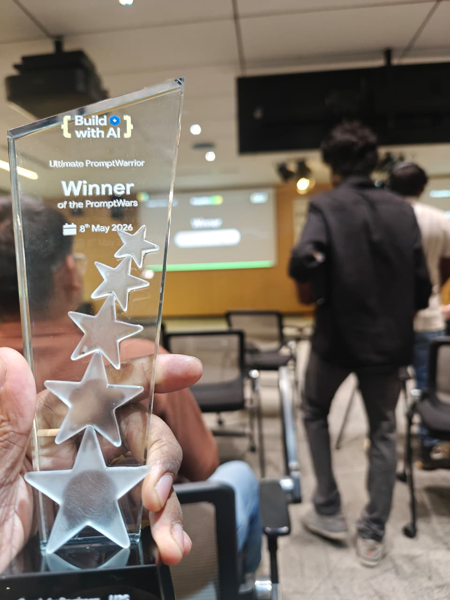

# Make-Life-Vibe

<div align="center">



**This trophy was won using exactly what's in this repo.**

*PromptWars Bengaluru 2026 · Build with AI · Google for Developers*  
*Score: 96.84% automated · Pitching Arena Winner · Ultimate PromptWarrior*

---

[](https://github.com/arjunmangarath/Make-Life-Vibe)
[](./SKILL.md)
[](./SKILL.md)
[](./LICENSE)
[](https://github.com/arjunmangarath/Make-Life-Vibe/stargazers)
[](https://ko-fi.com/arjunmangarath)

</div>

---

> **The complete hackathon execution methodology** — from problem statement to winning pitch.  
> Not theory. Every pattern in this repo was extracted from a real winning submission, built under pressure in a single day.

**If you've ever walked out of a hackathon feeling like you built something good but didn't win — this is why, and how to fix it.**

Hackathons aren't judged by vibes. They're scored on rubrics. This methodology teaches you to read the rubric first, map every criterion to code, and build in that order. The result: a 96.84% automated score and a pitching trophy on the first attempt it was used.

---

## 🚀 Install as a Claude Code Skill

Works with [Claude Code](https://claude.ai/code) CLI — invoke it at any hackathon with `/Make-Life-Vibe`.

**Mac / Linux:**
```bash
mkdir -p ~/.claude/skills/Make-Life-Vibe
curl -o ~/.claude/skills/Make-Life-Vibe/SKILL.md \
  https://raw.githubusercontent.com/arjunmangarath/Make-Life-Vibe/master/SKILL.md
```

**Windows (PowerShell):**
```powershell
New-Item -ItemType Directory -Force "$env:USERPROFILE\.claude\skills\Make-Life-Vibe"
Invoke-WebRequest -Uri "https://raw.githubusercontent.com/arjunmangarath/Make-Life-Vibe/master/SKILL.md" `
  -OutFile "$env:USERPROFILE\.claude\skills\Make-Life-Vibe\SKILL.md"
```

**Or clone and copy manually:**
```bash
git clone https://github.com/arjunmangarath/Make-Life-Vibe
cp Make-Life-Vibe/SKILL.md ~/.claude/skills/Make-Life-Vibe/SKILL.md
```

Once installed, open Claude Code in any project and run:

```
/Make-Life-Vibe
```

Claude will guide you through all 10 phases — from rubric analysis to winning pitch.

---

## 🔵 Built on Google

The winning submission — and this methodology — was built entirely on the Google ecosystem. Every service below was used in production and scored by the judges.

| Service | Role in the App | Why It Matters for Scoring |
|---------|----------------|---------------------------|
| **Gemini 2.5 Flash** | Core AI engine — generated structured JSON itineraries | Sponsor model = judges know it, integrations are stable |
| **Vertex AI (ADC)** | Enterprise auth via Application Default Credentials | No API key in code, no quota limits, scores security points |
| **Firebase Firestore** | 7-day TTL cache — SHA-256 hash of preferences as key | Instant demo responses, "⚡ Cached" badge visible to judges |
| **Firebase Analytics** | `trip_planned` + `itinerary_viewed` event tracking | Platform service usage = direct rubric criterion |
| **Google Maps Embed** | Per-day route map with all activity pins | No API key required — free iframe embed, zero setup |
| **Google Calendar** | Pre-filled event deep-links for every activity and day | No OAuth — URL scheme only, works instantly in demo |
| **Google Cloud Run** | Production deployment — asia-south1, 512Mi, 300s timeout | Sponsor cloud = direct rubric points, auto-scaling |

> **The rule:** For a Google hackathon, use **all** available Google services — not just Gemini. Judges track service usage explicitly. Each integration is a line on the rubric.

---

## 💡 What Is This?

A **replicable playbook** for building and winning AI hackathons — specifically those judged on code quality, security, testing, accessibility, and platform service usage.

Every pattern, snippet, and time budget in this repo was extracted from a real winning submission built under pressure in a single day.

**The core insight:** Hackathons are scored, not judged by vibes. Read the rubric first, map every criterion to code, then build in that order.

---

## 📐 The Methodology — 10 Phases

```
Phase 0 → Read the rubric. Map every criterion to an implementation.
Phase 1 → Pick the stack in 30 minutes (defaults that win, every time).
Phase 2 → Bootstrap the skeleton in 1 hour (types, errors, logger, API).
Phase 3 → The API route pattern (validate → cache → AI → validate → store).
Phase 4 → AI prompt engineering (inject today's date, sanitize all input).
Phase 5 → Caching (SHA-256 hash → Firestore → instant demo responses).
Phase 6 → Tests (100+ in 2 hours, node + jsdom environments).
Phase 7 → Accessibility checklist (free points, 30 minutes of work).
Phase 8 → Deploy (Cloud Run, set timeout to 300s or you'll 504).
Phase 9 → The pitch (5 slides, live demo, one number, next steps).
Phase 10 → 2-hour sprint checklist (when time is running out).
```

---

## 🎯 Phase 0 — Rubric-First Development

> **Rule:** If a feature doesn't map to a scoring criterion, build it last or not at all.

| Criterion | What to Build |
|-----------|--------------|
| Code Quality | TypeScript strict, Zod at every boundary, custom error hierarchy |
| Security | Rate limiting, CSP headers, prompt injection sanitization, `npm audit fix` |
| Testing | Jest multi-env (node + jsdom), 100+ tests across all layers |
| Accessibility | ARIA, semantic HTML, focus management, skip link, `aria-live` |
| Platform Services | Use **all** available services — not just the obvious one |
| Performance | Server-side caching, standalone build, lazy loading |
| Problem Statement | Name the real user pain in the hero text with a specific number |

---

## 🧰 Phase 1 — Default Tech Stack

| Layer | Choice | Why |
|-------|--------|-----|
| Framework | Next.js 15 (App Router) | SSR + API routes + standalone build in one repo |
| Language | TypeScript strict mode | Scores points on every code quality rubric |
| AI | Sponsor's preferred model | Judges know it, integrations work out of the box |
| Cache | Firestore / Supabase | Same vendor as AI auth = zero extra setup |
| Deploy | Sponsor's cloud | Cloud Run (Google), Vercel (Vercel), Railway (others) |
| Validation | Zod | Runtime + compile-time, used at every system boundary |
| Testing | Jest + Testing Library | Fast setup, covers node + browser in one `npm test` |

### Google Hackathon — Use All 6 Services

```
✅ Gemini AI via Vertex AI      (ADC — no API key, no quota limits)
✅ Firebase Firestore           (caching layer)
✅ Firebase Analytics           (event tracking)
✅ Google Maps Embed            (iframe, no API key required)
✅ Google Calendar URL scheme   (deep links, no OAuth)
✅ Google Cloud Run             (deployment)
```

---

## ⚡ Phase 2 — Bootstrap (1 Hour)

```bash
npx create-next-app@latest my-app --typescript --tailwind --app --src-dir
cd my-app
npm install zod firebase firebase-admin @google-cloud/vertexai
npm install -D jest @testing-library/react @testing-library/jest-dom ts-jest jest-environment-jsdom
```

**Create these files immediately — skeleton, fill later:**

```
src/
  types/index.ts           # All interfaces upfront
  lib/errors.ts            # Custom error hierarchy
  lib/env.ts               # Centralised env access
  lib/logger.ts            # Structured JSON logging
  app/api/plan/route.ts    # Main API route
  app/api/health/route.ts  # Health check (lists all services)
  middleware.ts            # Rate limiter
```

**Paste security headers into `next.config.ts` before writing any features:**

```typescript
const securityHeaders = [
  { key: "Strict-Transport-Security", value: "max-age=63072000; includeSubDomains; preload" },
  { key: "X-Frame-Options", value: "SAMEORIGIN" },
  { key: "X-Content-Type-Options", value: "nosniff" },
  { key: "X-XSS-Protection", value: "1; mode=block" },
  { key: "Referrer-Policy", value: "strict-origin-when-cross-origin" },
  { key: "Permissions-Policy", value: "camera=(), microphone=(), geolocation=(self)" },
  {
    key: "Content-Security-Policy",
    value: [
      "default-src 'self'",
      "script-src 'self' 'unsafe-eval' 'unsafe-inline' *.googleapis.com *.gstatic.com",
      "style-src 'self' 'unsafe-inline' *.googleapis.com",
      "img-src 'self' data: blob: *.googleapis.com *.gstatic.com *.google.com",
      "frame-src maps.google.com *.google.com",
      "connect-src 'self' *.googleapis.com *.google.com *.firebaseapp.com *.firebase.com",
      "font-src 'self' *.gstatic.com",
      "object-src 'none'",
      "base-uri 'self'",
      "upgrade-insecure-requests",
    ].join("; "),
  },
];
```

---

## 🔁 Phase 3 — The API Route Pattern

Every route follows this exact flow. Copy-paste and adapt:

```typescript
export async function POST(req: NextRequest) {
  const requestId = crypto.randomUUID();
  const startTime = Date.now();

  try {
    const body = await req.json();

    // 1. Validate input
    const parsed = InputSchema.safeParse(body);
    if (!parsed.success) throw new ValidationError("Invalid input", parsed.error.message);

    // 2. Cache check
    const cached = await getCache(parsed.data);
    if (cached) return jsonResponse({ data: cached, cached: true }, { "X-Cache": "HIT" });

    // 3. AI call
    const result = await callAI(parsed.data);

    // 4. Validate AI output (AI can return garbage)
    const validated = OutputSchema.safeParse(result);
    if (!validated.success) throw new GenerationError("Invalid AI response");

    // 5. Store + respond
    await setCache(parsed.data, validated.data);
    return jsonResponse(
      { data: validated.data, cached: false },
      { "X-Cache": "MISS", "X-Request-ID": requestId, "X-Response-Time": `${Date.now() - startTime}ms` }
    );
  } catch (err) {
    if (isAppError(err)) return errorResponse(err.message, err.statusCode);
    return errorResponse("Internal server error", 500);
  }
}
```

---

## 🤖 Phase 4 — AI Prompt Engineering

**Always inject today's date** — the AI uses it for seasonal context, current events, relevant advice:

```typescript
function buildPrompt(input: ValidatedInput, today: string): string {
  return `You are an expert [domain] assistant. Today's date is ${today}.

User request: ${sanitizeForPrompt(input.mainField)}

Return ONLY valid JSON matching this exact schema:
${JSON.stringify(outputSchema, null, 2)}

Rules:
- No markdown, no explanation, no code fences
- All fields required unless marked optional`;
}
```

**Always sanitize user input before it enters the prompt:**

```typescript
function sanitizeForPrompt(text: string, maxLength = 200): string {
  return text
    .replace(/[\x00-\x08\x0B-\x1F\x7F]/g, "") // control characters
    .replace(/`{3,}/g, "")                       // backtick injection
    .replace(/<script[^>]*>.*?<\/script>/gi, "") // script tags
    .trim()
    .slice(0, maxLength);
}
```

---

## ⚡ Phase 5 — Caching (Makes Your Demo Instant)

```typescript
// Deterministic SHA-256 hash of normalised inputs
async function hashInput(input: Record<string, unknown>): Promise<string> {
  const normalised = JSON.stringify(input, Object.keys(input).sort())
    .toLowerCase().replace(/\s+/g, " ");
  const buf = await crypto.subtle.digest("SHA-256", new TextEncoder().encode(normalised));
  return Array.from(new Uint8Array(buf))
    .map(b => b.toString(16).padStart(2, "0")).join("").slice(0, 20);
}
```

- Store in Firestore with `cachedAt` timestamp
- TTL check on read: reject if `now - cachedAt > 7 days`
- Return `null` on any error — never crash the main request
- Show `⚡ Cached` badge in UI — judges love seeing it work

---

## 🧪 Phase 6 — 100+ Tests in 2 Hours

**Jest multi-env config — run `npm test` for both:**

```typescript
export default {
  projects: [
    { displayName: "node", testEnvironment: "node", testMatch: ["**/*.test.ts"] },
    { displayName: "jsdom", testEnvironment: "jsdom", testMatch: ["**/*.test.tsx"],
      setupFilesAfterFramework: ["@testing-library/jest-dom"] },
  ],
};
```

**Write these suites in order of impact:**

| Suite | Tests | Time |
|-------|-------|------|
| Cache hashing | ~8 | 20 min |
| Sanitize function | ~10 | 15 min |
| Error hierarchy | ~26 | 20 min |
| Rate limiter | ~9 | 15 min |
| URL builders | ~12 | 20 min |
| React components | ~20 | 30 min |

---

## ♿ Phase 7 — Accessibility Checklist

```
✅ <a href="#main-content">Skip to main content</a> — first element in <body>
✅ Every input has <label htmlFor> or aria-label
✅ Toggle buttons use aria-pressed
✅ Results area: aria-live="polite" aria-atomic="true"
✅ Focus moves to results after async: useRef + useEffect
✅ Semantic HTML: <article> <section> <header> <time> <dl>
✅ Loading: role="status" — Error: role="alert"
✅ External links have aria-label describing destination
```

---

## 🚀 Phase 8 — Deploy to Cloud Run

```bash
gcloud run deploy my-service \
  --source . \
  --region asia-south1 \
  --memory 512Mi \
  --timeout 300 \
  --allow-unauthenticated \
  --project YOUR_PROJECT_ID
```

> **Critical:** `--timeout 300` — Default 60s causes 504 on any AI call.

---

## 🎤 Phase 9 — The 5-Minute Pitch

| Slot | Content | Duration |
|------|---------|----------|
| **Pain** | One sentence, one number. "This takes 4 hours. We do it in 10 seconds." | 10 sec |
| **Demo** | Live, not slides. Golden path + one edge case. | 2 min |
| **Tech** | Name every sponsor service. Architecture diagram. One sentence each. | 1 min |
| **Numbers** | Test count, cache hit time, security headers, CVE patched. | 30 sec |
| **Next step** | What you'd build next. Shows you think beyond the hackathon. | 30 sec |

**What judges actually check:**
- Does it work live? (Never demo from a recording)
- Do you understand what you built? (Explain caching in 2 sentences)
- Did you use the platform? (Name every service by its real product name)
- Is it real code? (Have the GitHub repo open)

---

## ⏱️ Phase 10 — 2-Hour Sprint Checklist

When time is short, execute in this order:

```
[ ] npm audit fix                          → patch CVEs (2 min, big security score impact)
[ ] X-Cache / X-Request-ID / X-Response-Time headers
[ ] /api/health endpoint listing all services
[ ] "Add to Calendar" links (URL scheme, no OAuth)
[ ] Location links (Maps search URL, no API key)
[ ] Weather/seasonal context field in AI output schema
[ ] aria-live on results container
[ ] 5 cache tests + 5 sanitize tests
[ ] "⚡ Cached" badge in UI
[ ] npm run build passes clean
```

---

## 📋 Reusable Copy-Paste Patterns

### Error Hierarchy

```typescript
export class AppError extends Error {
  constructor(message: string, public statusCode = 500) {
    super(message); this.name = this.constructor.name;
  }
}
export class ValidationError extends AppError {
  constructor(message: string, public details: string) { super(message, 400); }
}
export class GenerationError extends AppError {
  constructor(message: string, public cause?: Error) { super(message, 502); }
}
export class RateLimitError extends AppError {
  constructor(public retryAfterSeconds: number) { super("Too many requests", 429); }
}
export const isAppError = (e: unknown): e is AppError => e instanceof AppError;
```

### Rate Limiter (Edge-Compatible)

```typescript
const ipMap = new Map<string, { count: number; resetAt: number }>();
const LIMIT = 10, WINDOW = 60_000;

export function middleware(req: NextRequest) {
  const ip = req.headers.get("x-forwarded-for")?.split(",")[0] ?? "unknown";
  const now = Date.now();
  const entry = ipMap.get(ip);
  if (!entry || now > entry.resetAt) {
    ipMap.set(ip, { count: 1, resetAt: now + WINDOW });
  } else if (entry.count >= LIMIT) {
    const retryAfter = Math.ceil((entry.resetAt - now) / 1000);
    return new NextResponse("Rate limit exceeded", { status: 429,
      headers: { "Retry-After": String(retryAfter) } });
  } else { entry.count++; }
  return NextResponse.next();
}
```

### Structured Logger (Cloud Run)

```typescript
type Level = "INFO" | "WARN" | "ERROR";
export function log(level: Level, message: string, data?: Record<string, unknown>) {
  console.log(JSON.stringify({ severity: level, message, timestamp: new Date().toISOString(), ...data }));
}
export const logInfo  = (msg: string, d?: Record<string, unknown>) => log("INFO",  msg, d);
export const logWarn  = (msg: string, d?: Record<string, unknown>) => log("WARN",  msg, d);
export const logError = (msg: string, d?: Record<string, unknown>) => log("ERROR", msg, d);
```

---

## ❌ Anti-Patterns (What Loses Hackathons)

| Anti-Pattern | Why It Hurts |
|-------------|-------------|
| Building features before reading the rubric | You optimise for the wrong things |
| Using API keys when ADC is available | Quota limits, credentials in code |
| Skipping tests — "no time" | 30 tests take 45 minutes. No excuse. |
| Single Jest environment | Misses component tests entirely |
| Demo from screenshots | Judges see through it immediately |
| Forgetting `npm audit` | CVEs visible on submission = score drop |
| No cache | AI call times out during live demo |
| Hardcoded secrets | Instant disqualification at serious events |
| Generic pitch | "We built an AI app" vs "4 hours → 10 seconds" |

---

## ⏰ 6-Hour Time Budget

| Time | Activity |
|------|----------|
| 0:00 – 0:30 | Read rubric, map criteria to features, decide stack |
| 0:30 – 1:30 | Bootstrap: project, types, error hierarchy, env, logger, API skeleton |
| 1:30 – 3:30 | Core feature: AI integration, caching, main API route |
| 3:30 – 4:30 | UI: form + results view, accessibility pass |
| 4:30 – 5:00 | Tests: cache, sanitize, errors, rate limit, 1 component |
| 5:00 – 5:20 | Deploy, `npm audit fix`, health endpoint |
| 5:20 – 5:40 | Polish: loading states, error states, cached badge |
| 5:40 – 6:00 | Rehearse pitch: 3 run-throughs out loud |

---

## 🌐 Battle-Tested Reference

This methodology was used to build the **Travel Planning & Experience Engine** at PromptWars Bengaluru 2026:

- **Automated score:** 96.84% — top score in the event
- **Pitching Arena:** Winner — out of all finalists
- **Award:** Ultimate PromptWarrior (Google for Developers)
- **Stack:** Next.js 15 · Gemini 2.5 Flash · Firebase · Cloud Run · 137 tests

**This is not a methodology invented before the hackathon.** It was reverse-engineered from a live winning submission — every phase, time budget, and copy-paste snippet was extracted from code that already scored 96.84% under real pressure.

[→ View the winning project source code](https://github.com/arjunmangarath/promptwars-travel-engine)

---

## ⭐ If This Helped You

If you used this at a hackathon — won or not — drop a star. It helps other developers find this before their next event.

[](https://github.com/arjunmangarath/Make-Life-Vibe/stargazers)

Share it with someone entering their first AI hackathon. The patterns here take 10 minutes to install and hours off your execution time.

---

## ☕ Support This Work

This methodology is free and always will be. If it helped you ship faster, score higher, or win something — a coffee keeps the repo alive and more tools coming.

[](https://ko-fi.com/arjunmangarath)

Built by [Arjun Mangarath](https://github.com/arjunmangarath) — software, embedded systems, machine development, 3D CAD, and AI. Winner of PromptWars Bengaluru 2026.

---

## 📄 License

MIT — use this freely. Win something with it.
